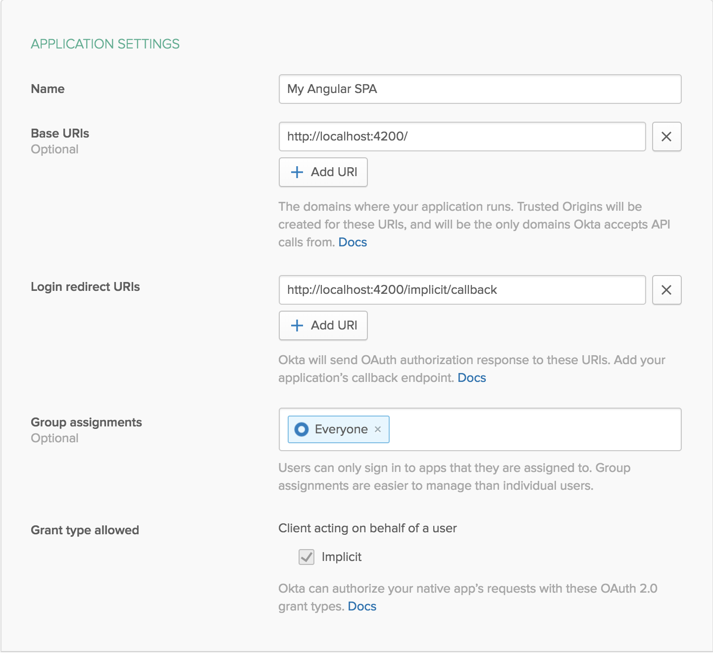

# Basic CRUD App with Node + Angular

This example app shows how to create a Node.js API and display its data with an Angular UI.

This project was bootstrapped with [Angular CLI](https://github.com/angular/angular-cli) version 6.0.8.

**Prerequisites**: [Node.js](https://nodejs.org/en/).

## Getting Started

To install this example application, run the following commands:

```bash
git clone git@github.com:oktadeveloper/angular-node-crud-example.git
cd angular-node-crud-example
```

This will get a copy of the project install locally. You will need to set up some environment variables before the app will run properly.

To integrate Okta's Identity Platform for user authentication, you'll first need to:

* [Sign up for a free Okta Developer account](https://www.okta.com/developer/signup/)
* You will get a URL similar to `https://dev-123456.oktapreview.com`.
  * Save this URL for later
  * You will also use this URL to login to your Okta account

You will need to create an application in Okta:

* Log in to your Okta account, then navigate to **Applications** and click the **Add Application** button
* Select **Single-Page App** and click **Next**
* Give your application a name (e.g. "My Angular App")
* Change the **Base URI** to `http://localhost:4200/` and the **Login redirect URI** to `http://localhost:4200/implicit/callback`, then click **Done**
* Save your **Client ID** for later

Your Okta application should have settings similar to the following:



Now create a file called `.env.js` in the `src/environments` folder of the project, then export the following variables, replacing the values with your own from the previous steps.


**.env.local**
```javascript
module.exports = {
  oktaOrgURL: 'https://{yourOktaOrgUrl}',
  oktaClientId: '{yourClientId}',
};
```

Now you can run both the Node API server and the Angular frontend with the same command:

```bash
npm start
```

## Links

This example uses the following libraries provided by Okta:

* [Okta JWT Verifier](https://github.com/okta/okta-oidc-js/tree/master/packages/jwt-verifier)
* [Okta Angular SDK](https://github.com/okta/okta-oidc-js/tree/master/packages/okta-angular)

## Help

Please [raise an issue](https://github.com/oktadeveloper/angular-node-crud-example/issues) if you find a problem with the example application, or visit our [Okta Developer Forums](https://devforum.okta.com/). You can also email [developers@okta.com](mailto:developers@okta.com) if would like to create a support ticket.

## License

Apache 2.0, see [LICENSE](LICENSE).
